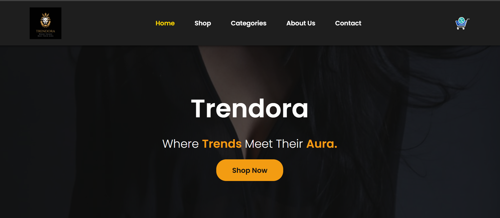
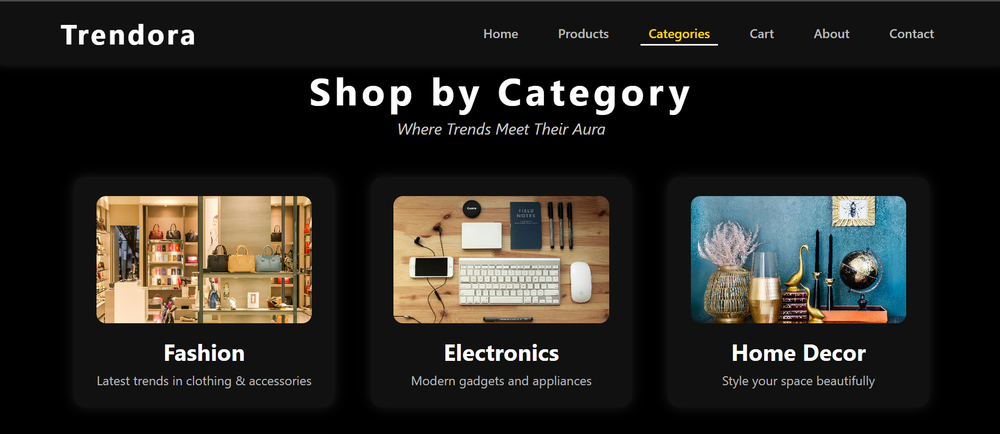
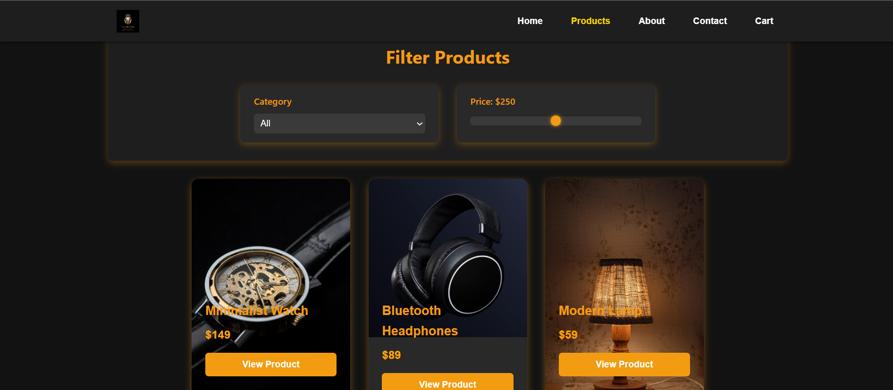
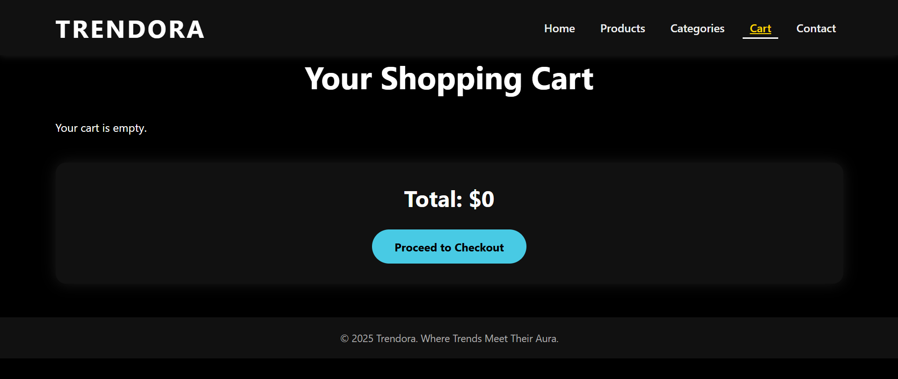
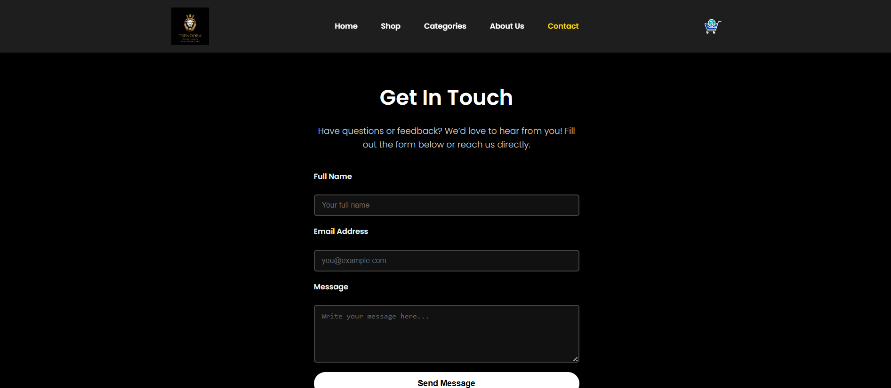

# 🛍️ Trendora

**Slogan:** _"Where Trends Meet Their Aura"_

Welcome to **Trendora** — a modern, visually stunning e-commerce website designed to deliver a premium shopping experience. This project is fully designed using **HTML5**, **CSS3**, and **JavaScript** for interactivity.

---

## 🎯 Project Overview

Trendora is a feature-rich frontend project focused on clean UI/UX for an online shopping website. Built for portfolio and educational purposes, it mimics real-world e-commerce functionality with aesthetic appeal and responsive design.

---

## 👤 Developer Info

- **Name:** Prince Maheshbhai Makwana
- **Project Title:** Trendora – E-Commerce Website
- **College:** Dhirubhai Ambani University, IIT Madras
- **Internship Organization:** Internship Studio
- **Type:** Website Design Internship Project

---

## 📁 Pages & Features

| Page                        | Features Included                                                                                                                                     |
|----------------------------|--------------------------------------------------------------------------------------------------------------------------------------------------------|
| **Home Page**              | Navbar, Hero Slider, Shop by Category, Latest Products, Features Section, Footer, Scroll-to-Top Button                                                |
| **Products Page**          | Product Listings, Category Filter, Price Range Filter                                                                                                  |
| **Product View Page**      | Title, Images, Description, Price, Ratings, Related Products, Add to Cart                                                                              |
| **Category Page**          | Category List, Images, Short Descriptions                                                                                                              |
| **Cart Page**              | Product Summary with Image, Quantity, Individual Price, Total                                                                                          |
| **Checkout Page**          | Order Summary, Shipping Info Form                                                                                                                      |
| **Order Confirmation Page**| Confirmation Message, Order Number, Status                                                                                                              |
| **About Us Page**          | Brand Story, Features, Testimonials                                                                                                                     |
| **Contact Us Page**        | Contact Info, Message Form with JS/jQuery Validation                                                                                                    |
| **Search Page**            | Search Bar, Dynamic Product Listing                                                                                                                     |

---

## 🎨 Aesthetic Style

- **Theme**: Dark elegance (black background, white text)
- **Typography**: Modern sans-serif
- **Color Palette**: Black, White, Gray with accent colors (Gold or Blue)
- **Logo**: Gold-on-black branding with slogan

---

## 🛠️ Tech Stack

- HTML5
- CSS3 (Flexbox, Grid)
- JavaScript (for form validation, filtering, interactivity)
- jQuery (Optional, for form validation)

---

## 📸 Screenshots

### 🏠 Homepage


### 📂 Categories Page


### 🛍️ Products Page


### 🛒 Cart Page


### ✉️ Contact Page


### ℹ️ About Page


---
## 🧾 How to Run Locally

1. Clone the repo:
   ```bash
   git clone https://github.com/Prince-pm/Trendora.git
